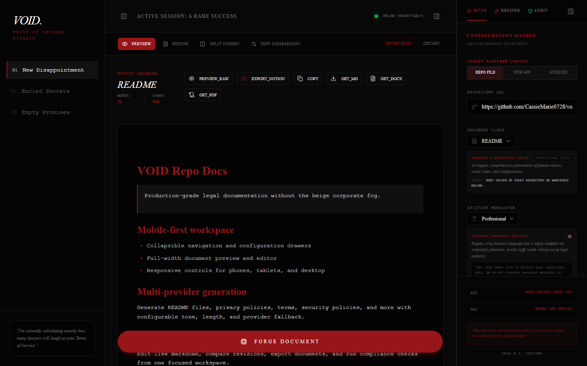
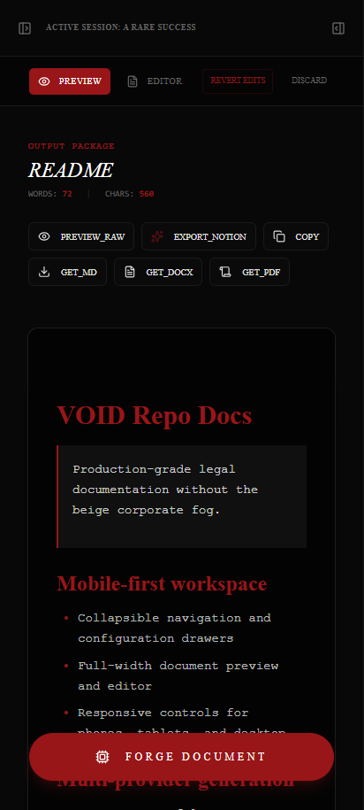

# VOID Repo Docs

<p align="center">
  
</p>

> AI-assisted legal and repository document generation for GitHub projects, web applications, and
> Android apps. It writes the paperwork while you continue pretending the dependency graph is fine.

VOID Repo Docs is a full-stack TypeScript application with a React 19 workspace, an Express API,
four supported LLM providers, GitHub repository analysis, Notion export, multi-draft editing, and a
Capacitor Android shell.

It can generate 15 document classes in six tones, including the application's `Deadpool-cool`
setting: original mercenary-grade sarcasm, developer-specific mockery, and no copyrighted character
references.

> [!WARNING]
> Generated legal text is a starting template, not legal advice. Have qualified counsel review
> anything that could affect actual users, money, privacy, employment, licensing, or your future
> ability to sleep.

## Start Here

```powershell
npm install
Copy-Item .env.example .env
npm run dev
```

Open [http://localhost:3000](http://localhost:3000).

At least one provider key is required to generate documents:

```dotenv
GEMINI_API_KEY=
MISTRAL_API_KEY=
GROQ_API_KEY=
OPENROUTER_API_KEY=
```

Run the standard checks before declaring victory:

```powershell
npm run lint
npm run build
```

## What It Does

- Generates README files, policies, agreements, licenses, and governance documents.
- Uses GitHub metadata, README content, license text, and `package.json` as generation context.
- Supports GitHub repository, web app, and Android app compliance profiles.
- Produces one to five parallel drafts with distinct variation profiles.
- Offers preview, edit, split, and diff workspaces.
- Refines drafts with Gemini-powered presets or custom instructions.
- Audits common legal and privacy clauses with local heuristic checks.
- Replaces `[Placeholder]` variables during preview, copy, and download.
- Exports Markdown, Word-compatible HTML, print-to-PDF output, and Notion pages.
- Restores drafts and preferences from browser storage.
- Packages the web client as a native Android application with Capacitor.
- Collapses both side panels into mobile drawers so the editor gets the screen instead of fighting
  two menus for custody of six inches of glass.

## Documentation

The complete documentation lives in [`docs/`](docs/README.md).

| Guide | Purpose |
| --- | --- |
| [Getting Started](docs/getting-started.md) | Installation, configuration, first run, and verification |
| [User Guide](docs/user-guide.md) | Complete workflow for generation, editing, audit, and export |
| [Architecture](docs/architecture.md) | Runtime boundaries, data flow, state, and component map |
| [API Reference](docs/api-reference.md) | Request/response contracts and endpoint behavior |
| [AI Providers](docs/ai-providers.md) | Provider selection, models, fallback behavior, and keys |
| [Android](docs/android.md) | Capacitor architecture, APK/AAB builds, signing, and testing |
| [Deployment](docs/deployment.md) | Production build, hosting, environment, CORS, and operations |
| [Security](docs/security.md) | Threat model, secret handling, privacy, and hardening priorities |
| [Repository Reference](docs/repository-reference.md) | File map, scripts, types, storage keys, and dependencies |
| [Contributing](docs/contributing.md) | Development workflow, conventions, and change checklists |
| [Troubleshooting](docs/troubleshooting.md) | Failure symptoms, causes, and concrete repairs |

## Product Showcase

[Watch the feature showcase](assets/showcase/void-repo-docs-showcase.webm).

| Desktop workspace | Mobile workspace |
| --- | --- |
|  |  |

## Technology

- React 19, TypeScript 5.8, Vite 8, Tailwind CSS 4
- Express 4, Zod 4, Axios
- Google Gemini, Mistral, OpenRouter, Groq
- Capacitor 8 and Android Gradle Plugin 8.13
- Motion, React Markdown, Lucide, Sonner, shadcn-style UI primitives

## Legal Reality Check

VOID can generate convincing legal structure. It cannot know every jurisdiction, business practice,
data flow, contractual promise, or spectacularly creative mistake your organization may produce.
Review placeholders, verify factual claims, confirm applicable law, and obtain legal review.

## License

No root `LICENSE` file is currently present. Until one is added, copyright law reserves the usual
rights by default. That is not mysterious open-source licensing; it is an unfinished decision wearing
a trench coat.
