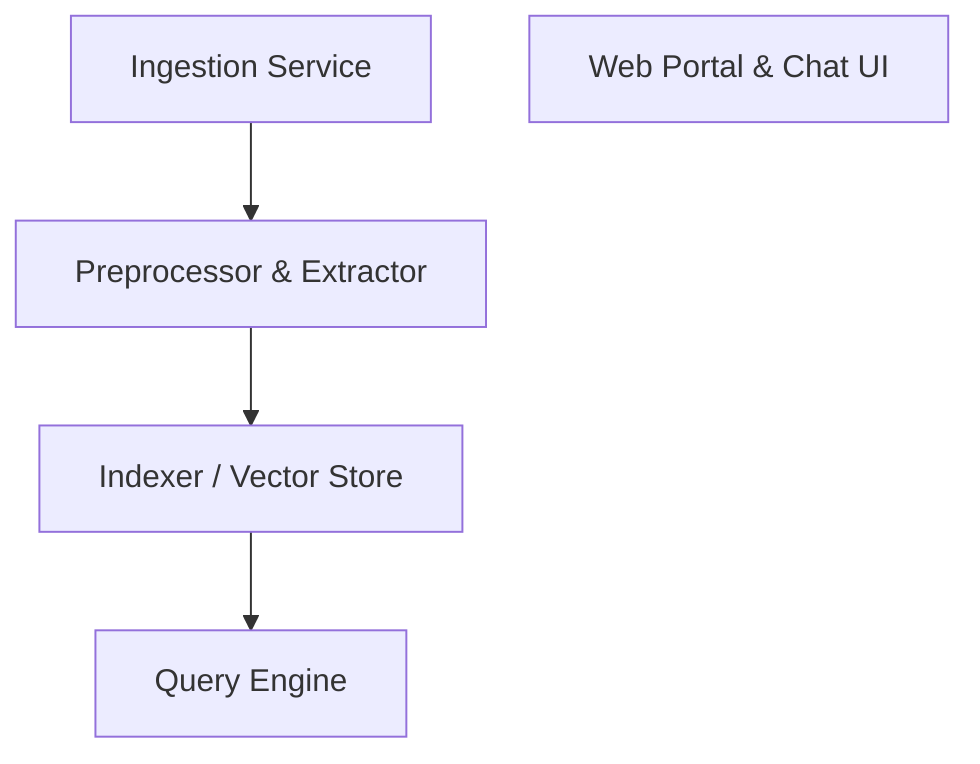

# 📚 void-repo-docs Documentation

Welcome to the complete documentation for this repository. This documentation is automatically generated and maintained by Woden Docbot.

   

## 🔗 Quick Links

[📂 android](./android/README.md) | [📂 github](./github/README.md) | [📂 idx](./idx/README.md)
[📂 lib](./lib/README.md) | [📂 scripts](./scripts/README.md) | [📂 src](./src/README.md)
[📋 Dependencies](./DEPENDENCIES.md)

---

> DocBot ingests and indexes organizational documents to provide fast, contextual, and conversational retrieval across teams.

## 📖 Overview

DocBot is a document ingestion, indexing, and conversational retrieval system designed to make enterprise knowledge accessible and actionable. It processes documents from multiple sources, extracts semantic embeddings, and stores them in a vector store to enable precise, context-aware search and Q&A.

The platform supports streaming ingestion pipelines, automated metadata extraction, and relevance tuning so teams can surface the right information quickly. By combining vector search with an LLM-powered query layer, DocBot reduces time-to-answer, improves onboarding, and enhances customer support and compliance workflows.

### 🧩 Key Components

| Component | Purpose | Technologies |
| --- | --- | --- |
| **Ingestion Service** | Collects documents from sources (S3, Google Drive, email, repos), normalizes formats, and queues items for processing. | `Python`, `AWS S3`, `GCS connectors` |
| **Preprocessor & Extractor** | Cleans text, extracts metadata, performs OCR for images/PDFs, and generates chunks for embedding. | `Tika`, `OCR (Tesseract)`, `Python` |
| **Indexer / Vector Store** | Generates embeddings for document chunks and stores them in a vector database for fast similarity search. | `OpenAI embeddings`, `Milvus`, `FAISS` |
| **Query Engine** | Handles user queries, performs semantic retrieval, re-ranks results, and orchestrates LLM prompts to produce concise answers. | `FastAPI`, `LangChain`, `OpenAI API` |
| **Web Portal & Chat UI** | Provides a user interface for searching, browsing results, asking questions, and managing document sources and access controls. | `React`, `TypeScript`, `Tailwind CSS` |

**Component Architecture:**

### 🏗️ Architecture

Hybrid architecture with serverless ingestion pipelines and a microservices-based query layer. Documents flow from connectors into preprocessing and embedding jobs, stored in a vector database; stateless APIs and an LLM orchestrator provide conversational retrieval and UI access.

### 💡 Use Cases

- ✦ Enterprise knowledge search for internal documentation and engineering runbooks
- ✦ Customer support augmentation with contextual, up-to-date answers drawn from product docs and tickets
- ✦ Compliance and audit discovery by surfacing documents that match regulatory queries

### 🔧 Technologies

**Languages:** 

**Frameworks:**  

**Cloud:** 

**Databases:**  
    

### 📦 External Dependencies

The following external packages are used across the project:

- `AWS S3`
- `Apache Kafka`
- `FAISS`
- `Milvus`
- `OpenAI API`
- `PostgreSQL`
- `Redis`
- `Tesseract OCR`
- `Tika`

---

## 📑 Documentation Sections

### [android](./android/README.md)
This directory contains the Android-specific Gradle build and configuration files for the project, including top-level build scripts, settings, Gradle wrapper, and centralized version variables. These files are intended to configure the build environment, declare project modules, provide reusable version constants, and allow developers to run Gradle on Windows via the wrapper script.

Within this directory, build.

### [github](./github/README.md)
This directory holds GitHub-level configuration for repository automation. Its primary role is to store configuration files that control repository maintenance and platform-integrated tooling.

Currently the directory contains a Dependabot configuration that instructs GitHub Dependabot how to keep dependencies up to date for multiple package ecosystems in the repository.

The directory currently contains a single configuration file (dependabot.

### [idx](./idx/README.md)
This directory contains configuration for a development environment index intended to be consumed by development tooling. The primary artifact declares a stable Nix channel, runtime selections, editor extensions, and a preview / launch configuration for running a web preview.

The contents are organized as a small collection of configuration files (currently a single file) that together define how the development environment should be provisioned and how a preview should be launched for the project.

This directory currently contains a single configuration file (dev.

### [lib](./lib/README.md)
This directory contains small reusable utilities intended to help with CSS class name composition and normalization for UI components, particularly in projects that use Tailwind CSS. The utilities centralize how class strings are built and merged so components can rely on a consistent, composable approach for class name handling.

The lib directory is small and contains the utilities module utils.

### [scripts](./scripts/README.md)
This directory contains helper scripts used to prepare and invoke Android Gradle builds from a host machine. The scripts probe the local environment for required tooling (Java JDK and Android SDK), set environment variables, and then invoke the Gradle wrapper with a provided task name.

The scripts are intended to be small, self-contained PowerShell helpers to make invoking Android Gradle tasks more reliable across different host setups by locating common installation locations and setting JAVA_HOME and related environment variables before running the wrapper.

This directory contains a single PowerShell script and no detected within-directory imports or inheritance relationships; the file is standalone.

### [src](./src/README.md)
This src directory contains the primary client-side source for a TypeScript React application plus a global stylesheet and type declarations. The files include UI component code, type definitions, a small API-related module, an application entrypoint, and global CSS that defines theme and typographic rules.

The files in this directory represent distinct pieces of a typical client-side application: a UI component (App.

---

## 📊 Documentation Statistics

- **Files Documented**: 0
- **Directories**: 21
- **Coverage**: 100%
- **Last Updated**: 2026-08-11

---

## 🧭 How to Navigate

> ℹ️ **INFO**
> Each directory has its own README.md with detailed information about that section. Use the breadcrumb navigation at the top of each page to navigate back to parent directories.

### Navigation Features

- **Breadcrumbs** - At the top of each page, showing your current location
- **Directory READMEs** - Each folder has a comprehensive overview
- **File Documentation** - Click through to individual file documentation
- **Search** - Use GitHub's search or your IDE's search functionality

---

## 🤖 About Woden DocBot

This documentation is automatically generated and kept up-to-date by Woden DocBot, an AI-powered documentation assistant. DocBot analyzes code on every pull request and updates documentation to reflect changes.

### Features

- **Automatic Updates** - Documentation updates on every PR
- **Comprehensive Coverage** - Files, functions, classes, and directories
- **Smart Navigation** - Breadcrumbs, related files, and parent links
- **AI-Powered** - Uses Azure GPT models for intelligent documentation generation

---

*Generated by Woden DocBot for void-repo-docs*