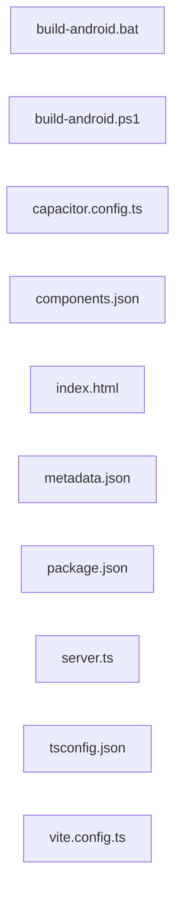

<!-- METADATA: {"source_path": "", "source_sha": "ef1a770948254f3d8e90292ac4ac6515753fd947", "extraction_quality": "full_ast", "model": "gpt-5-mini", "generated_at": "2026-08-11T22:54:21Z", "doc_type": "directory"} -->
# (root)

> **Directory:** ``

## Purpose

This directory contains the configuration, build helpers, and minimal application entry points for a mixed TypeScript/JavaScript web project that also includes native Android/Capacitor build scripts and a small server-side utilities module. It collects project-level configuration (package.json, tsconfig.json, vite and Capacitor configs), front-end scaffolding (index.html, components.json), metadata, and platform-specific build helpers for Android.

The files together support development, build, and packaging workflows for both web and mobile shells, and include a server-side TypeScript module that provides helpers used by the application when interacting with external services.

## Architecture Diagram

## Files

| File | Description |
| --- | --- |
| `server.ts` | A TypeScript module that sets up server-side utilities and helpers for a web application, importing Express/Vite tooling, axios, dotenv, zod, and a Google GenAI client, and exposing four top-level functions used to interface with external services and application-specific types. |
| `build-android.bat` | A Windows batch script that automates Android build and maintenance tasks for the repository, dispatching to npm scripts to build debug/release APKs, create AABs, clean artifacts, sync web assets, and show help. |
| `build-android.ps1` | A PowerShell command-line helper that prints usage and dispatches Android-related tasks (debug/release APK, AAB, clean, sync) by invoking corresponding npm scripts and checking exit codes. |
| `capacitor.config.ts` | A TypeScript Capacitor configuration module that imports the CapacitorConfig type and provides a typed configuration object used when building and running native shells around the web application. |
| `components.json` | A JSON configuration file for the project's UI/library that defines settings such as a UI schema URL, style theme, TypeScript JSX usage, Tailwind-related options, and the chosen icon set. |
| `index.html` | A minimal HTML document shell for the client-side application with a root mounting div and a module script reference to /src/main.tsx that bootstraps the frontend. |
| `metadata.json` | A metadata file describing a component named 'VOID: Repository Documents' with high-level metadata about a documentation generator for GitHub repositories and a brief description of its style and capabilities. |
| `package.json` | The project's package.json declaring the project name, version, npm scripts for development, building, cleaning, linting and Android tasks, and listing runtime and dev dependencies used by the tooling and frameworks. |
| `tsconfig.json` | A TypeScript configuration file specifying compiler and project options including language targets (ES2022, DOM), experimental decorators and class field behavior, ESNext modules, JSX support for React's new transform, and allowing JavaScript imports. |
| `vite.config.ts` | A Vite configuration TypeScript module that imports defineConfig and loadEnv from Vite, integrates a Tailwind CSS plugin, and references Node's path module to define build and dev settings. |

## Subdirectories

Use these links to drill into the child directory READMEs for this section.

- [.github](./.github/README.md)

- [.idx](./.idx/README.md)

- [android](./android/README.md)

- [assets](./assets/README.md)

- [components](./components/README.md)

- [docs](./docs/README.md)

- [lib](./lib/README.md)

- [scripts](./scripts/README.md)

- [src](./src/README.md)

## Key Components

- **`Server utilities`** (in `server.ts`) — Provides the server-side helpers and utilities used by the application to interact with external services and perform server responsibilities; it is the main server-side entry in this directory and shapes backend behavior.
- **`Project manifest and scripts`** (in `package.json`) — Orchestrates development, build, and platform-specific tasks (including Android/Capacitor operations) and declares dependencies; it is the central entry point for running the workflows referenced by other tooling and scripts in the directory.
- **`Vite configuration`** (in `vite.config.ts`) — Defines the frontend bundler and dev-server behavior (including Tailwind integration) used to build and serve the web application, making it a key piece of the frontend build pipeline.
- **`Capacitor configuration`** (in `capacitor.config.ts`) — Provides the typed configuration for building native shells around the web app with Capacitor, which is essential for producing mobile artifacts and coordinating native integration with the web code.

## Architecture Notes

No within-directory imports or inheritance relationships were detected by the extraction process, so the files are described here as a collection of complementary components rather than an explicit import graph. Conceptually, the directory contains (a) a server-side utility module (server.ts), (b) frontend entry and build configuration (index.html, vite.config.ts, components.json), (c) TypeScript compiler settings (tsconfig.json), (d) project metadata and manifest (metadata.json, package.json), and (e) mobile/native-related configuration and scripts (capacitor.config.ts, build-android.bat, build-android.ps1). There is no extracted evidence in these files of direct internal module imports linking them; any runtime or build-time integration between these pieces (for example, how npm scripts in package.json invoke the build scripts or how the Vite config is consumed) is not shown in the detected within-directory relationships.

## Extraction Quality Note

Several files were extracted with lower-fidelity methods (regex_fallback or raw_source): build-android.bat, build-android.ps1, capacitor.config.ts, components.json, index.html, metadata.json, package.json, server.ts, tsconfig.json, and vite.config.ts; their structure or detailed internals may be incomplete or approximated in these summaries.

---

## Navigation

**🔗 Related:** [.github](./.github/README.md) • [.idx](./.idx/README.md) • [android](./android/README.md) • [assets](./assets/README.md) • [components](./components/README.md) • [docs](./docs/README.md) • [lib](./lib/README.md) • [scripts](./scripts/README.md) • [src](./src/README.md)

---

This README was generated by [DocBot](https://github.com/marketplace/docbot-by-woden) from the structural analysis of the files in this directory. AI-generated content can contain mistakes — verify against the source code before acting on architectural claims.
