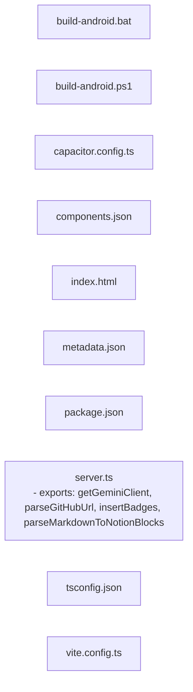

<!-- METADATA: {"source_path": "", "source_sha": "ef1a770948254f3d8e90292ac4ac6515753fd947", "extraction_quality": "full_ast", "model": "gpt-5-mini", "generated_at": "2026-08-11T22:53:49Z", "doc_type": "directory"} -->
# (root)

> **Directory:** ``

## Purpose

This directory contains a mix of TypeScript source, JSON configuration, shell/PowerShell helper scripts, and static assets that together support a web application and its native build tooling. It includes server-side utilities, frontend entry HTML, build and packaging scripts for Android/Capacitor, and project-wide configuration files for tooling such as Vite, TypeScript, and Tailwind/Component theming.

## Architecture Diagram

## Files

| File | Description |
| --- | --- |
| `server.ts` | A TypeScript module that sets up server-side utilities and helpers for a web application that interfaces with external services; it imports Express/Vite tooling, axios, dotenv, zod, and a Google GenAI client and exposes four top-level functions used by the app (extraction quality: regex fallback). |
| `build-android.bat` | A Windows batch script that automates Android build and maintenance tasks such as producing debug/release APKs, creating AABs, cleaning build artifacts, syncing web assets, and showing help. |
| `build-android.ps1` | A PowerShell command-line helper that dispatches Android-related tasks (build debug/release APKs, create AAB, clean artifacts, sync web assets) by invoking corresponding npm scripts and checking exit codes. |
| `capacitor.config.ts` | A TypeScript Capacitor configuration module that imports the CapacitorConfig type and provides project-level settings used when building and running native shells around the web application (extraction quality: regex fallback). |
| `components.json` | A JSON configuration file for a frontend UI/library that defines high-level settings like a UI schema URL, style theme (base-nova), TypeScript JSX usage, Tailwind options, and icon selection. |
| `index.html` | A minimal HTML document shell for the client-side application with a root mounting div and a module script reference to /src/main.tsx that bootstraps the frontend. |
| `metadata.json` | A metadata file describing a component named "VOID: Repository Documents", providing high-level descriptive data about the documentation generator’s persona and declared capabilities. |
| `package.json` | The project package manifest for a project named "react-example" that declares npm scripts for development and Android/Capacitor tasks and lists runtime and dev dependencies for the build tooling and frameworks. |
| `tsconfig.json` | A TypeScript configuration file that sets language/library targets (ES2022, DOM), enables experimental decorators and specific class field behavior, configures ESNext modules and bundler resolution, and enables React JSX support among other options. |
| `vite.config.ts` | A TypeScript Vite configuration module that imports Vite utilities (defineConfig, loadEnv), a Tailwind CSS integration plugin, and Node path utilities to define build/dev settings (extraction quality: regex fallback). |

## Subdirectories

Use these links to drill into the child directory READMEs for this section.

- [.github](./.github/README.md)

- [.idx](./.idx/README.md)

- [android](./android/README.md)

- [assets](./assets/README.md)

- [components](./components/README.md)

- [docs](./docs/README.md)

- [lib](./lib/README.md)

- [scripts](./scripts/README.md)

- [src](./src/README.md)

## Key Components

- **`Server utilities`** (in `server.ts`) — Provides the server-side helpers and functions that the application uses to interact with external services and to implement backend behavior; it is the primary server-side entry in this directory.
- **`Project manifest and scripts`** (in `package.json`) — Declares the npm scripts used for development, building, and Android/Capacitor tasks and lists dependencies, making it the control point for how builds and tooling are invoked for this repository.
- **`Frontend entry`** (in `index.html`) — Acts as the static HTML shell and mounting point for the client application and points at the module that bootstraps the frontend, so it is the runtime entry for the web UI.
- **`Vite configuration`** (in `vite.config.ts`) — Holds the build and dev server configuration for Vite (including Tailwind integration) and therefore shapes how the frontend is bundled and served during development and production builds.

## Architecture Notes

No within-directory imports or inheritance relationships were detected by the extraction process, so the files should be treated as a collection of related but not explicitly linked artifacts rather than as a tightly coupled module graph. Broadly, this directory contains: (a) server-side code (server.ts), (b) frontend entry/static asset (index.html), (c) project and tooling configuration (package.json, tsconfig.json, vite.config.ts, capacitor.config.ts, components.json), (d) metadata about the component (metadata.json), and (e) platform build helper scripts (build-android.bat, build-android.ps1). Each file plays a distinct role (runtime, configuration, metadata, or build helper) but no direct file-to-file imports within this directory were reported by the extraction.

## Extraction Quality Note

Several files were extracted with lower-structure methods (regex_fallback or raw_source): server.ts, capacitor.config.ts, vite.config.ts (regex_fallback) and build-android.bat, build-android.ps1, components.json, index.html, metadata.json, package.json, tsconfig.json (raw_source); structural details such as exact exported names or typed shapes may be incomplete and are hedged in this summary.

---

## Navigation

**🔗 Related:** [.github](./.github/README.md) • [.idx](./.idx/README.md) • [android](./android/README.md) • [assets](./assets/README.md) • [components](./components/README.md) • [docs](./docs/README.md) • [lib](./lib/README.md) • [scripts](./scripts/README.md) • [src](./src/README.md)

---

This README was generated by [DocBot](https://github.com/marketplace/docbot-by-woden) from the structural analysis of the files in this directory. AI-generated content can contain mistakes — verify against the source code before acting on architectural claims.
