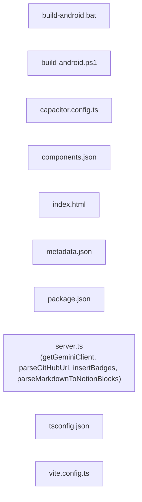

<!-- METADATA: {"source_path": "", "source_sha": "ef1a770948254f3d8e90292ac4ac6515753fd947", "extraction_quality": "full_ast", "model": "gpt-5-mini", "generated_at": "2026-08-11T22:56:20Z", "doc_type": "directory"} -->
# (root)

> **Directory:** ``

## Purpose

This directory contains the main pieces of a mixed TypeScript/JSON/utility project that includes server-side helpers, frontend bootstrapping, build and platform scripts, and configuration for tools like Vite, Capacitor, and TypeScript. Files include runtime code (server.ts), project metadata and tool configuration (package.json, tsconfig.json, vite.config.ts, capacitor.config.ts, components.json), simple client entry HTML (index.html), build helper scripts for Android, and descriptive metadata for the project.

## Architecture Diagram

## Files

| File | Description |
| --- | --- |
| `server.ts` | This TypeScript module sets up server-side utilities and helpers used in a web application that interfaces with external services; it exposes four top-level functions and imports tooling such as Express/Vite helpers, axios, dotenv, zod, and a Google GenAI client (summary hedged due to regex-based extraction). |
| `build-android.bat` | A Windows batch script that automates common Android build and maintenance tasks for the repository, dispatching commands for building debug/release APKs and AABs, cleaning, syncing web assets, and showing help. |
| `build-android.ps1` | A PowerShell command-line helper that provides similar Android build and maintenance dispatch for the project, defining a Show-Help function and invoking npm scripts for build-related operations. |
| `capacitor.config.ts` | A TypeScript Capacitor configuration module that imports the CapacitorConfig type and declares project-level settings used when building and running native shells around the web application (extraction is limited). |
| `components.json` | A JSON configuration file likely used by a component toolkit or design system that specifies UI schema URL, theme, JSX/TSX usage, Tailwind options, icon choices, and other high-level UI settings. |
| `index.html` | A minimal HTML document shell for the client-side application that sets up charset/viewport metadata, includes a root div with id "root", and references the frontend bootstrap module at /src/main.tsx. |
| `metadata.json` | A metadata descriptor for a component named "VOID: Repository Documents" that characterizes the project as a GitHub repository documentation generator and contains high-level descriptive metadata and capability listings. |
| `package.json` | The project's package manifest (react-example) that declares metadata, a set of npm scripts for development/build/Android tasks, and lists runtime and development dependencies used by the tooling and frameworks. |
| `tsconfig.json` | A TypeScript configuration file specifying compiler options (ES2022, DOM libs, decorators, class field behavior), module resolution, JSX support for React's new transform, and project-level compile settings. |
| `vite.config.ts` | A Vite configuration module that integrates Vite utilities (defineConfig, loadEnv), a Tailwind CSS plugin for Vite, and Node path handling to define build/dev settings (extraction is limited). |

## Subdirectories

Use these links to drill into the child directory READMEs for this section.

- [.github](./.github/README.md)

- [.idx](./.idx/README.md)

- [android](./android/README.md)

- [assets](./assets/README.md)

- [components](./components/README.md)

- [docs](./docs/README.md)

- [lib](./lib/README.md)

- [scripts](./scripts/README.md)

- [src](./src/README.md)

## Key Components

- **`Server utilities`** (in `server.ts`) — server.ts provides the server-side helpers and exported functions that implement runtime behavior for backend interactions and integrations with external services; understanding it is essential for modifying server logic or how the app communicates with external APIs.
- **`Project scripts & dependencies`** (in `package.json`) — package.json centralizes npm scripts for development, building, and Android-related workflows as well as the dependency list required to run and build the project, so it is the primary entry point for running or modifying the project's developer and build tooling.
- **`Frontend bundler config`** (in `vite.config.ts`) — vite.config.ts configures how the frontend is built and served (including Tailwind integration), so changes here affect the development server, build output, and CSS processing used by the client-side code.
- **`Android build helpers`** (in `build-android.bat`) — The build-android.bat (and its PowerShell counterpart) provide convenient, repository-specific commands for producing Android artifacts, cleaning, and syncing web assets — these are useful for maintainers who need to build or distribute native Android artifacts from this codebase.

## Architecture Notes

No within-directory imports or inheritance relationships were detected by the available extraction, so there is no asserted internal module dependency graph to describe. The directory should therefore be treated as a collection of cooperating files: server.ts supplies server-side functionality; index.html is the minimal client entry that expects a frontend bootstrap module; vite.config.ts and tsconfig.json configure the build and TypeScript compilation; package.json ties together scripts and dependencies used across development and build tasks; capacitor.config.ts and the Android build scripts provide native-shell and platform-specific build helpers; components.json and metadata.json contain UI and component metadata.

## Extraction Quality Note

Many files (build-android.bat, build-android.ps1, capacitor.config.ts, components.json, index.html, metadata.json, package.json, server.ts, tsconfig.json, vite.config.ts) were extracted using raw_source or regex_fallback; structural details (exact function signatures, types, or precise config properties) may be incomplete or approximate as a result.

---

## Navigation

**🔗 Related:** [.github](./.github/README.md) • [.idx](./.idx/README.md) • [android](./android/README.md) • [assets](./assets/README.md) • [components](./components/README.md) • [docs](./docs/README.md) • [lib](./lib/README.md) • [scripts](./scripts/README.md) • [src](./src/README.md)

---

This README was generated by [DocBot](https://github.com/marketplace/docbot-by-woden) from the structural analysis of the files in this directory. AI-generated content can contain mistakes — verify against the source code before acting on architectural claims.
