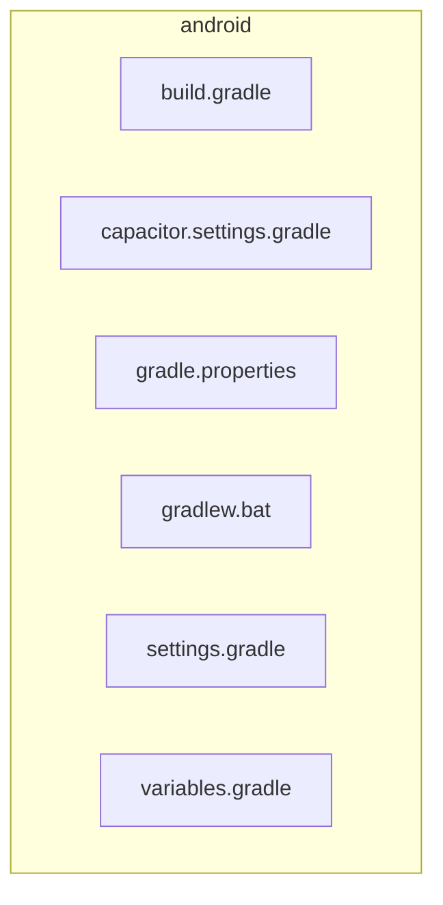

<!-- METADATA: {"source_path": "android", "source_sha": "33783949c4f562f70602e5aa4caba8d2196849bd", "extraction_quality": "full_ast", "model": "gpt-5-mini", "generated_at": "2026-08-11T22:52:19Z", "doc_type": "directory"} -->
[Documentation Home](../README.md) > [android](./README.md) > **android**

---

# android

> **Directory:** `android`

## Purpose

This directory contains the Android-specific Gradle build and configuration files for the project, including top-level build scripts, settings, Gradle wrapper, and centralized version variables. These files are intended to configure the build environment, declare project modules, provide reusable version constants, and allow developers to run Gradle on Windows via the wrapper script.

## Architecture Diagram

## Files

| File | Description |
| --- | --- |
| `build.gradle` | Top-level Gradle build script that configures the buildscript classpath and repositories used to resolve Gradle plugins, applies an external variables.gradle file, declares repositories for all subprojects, and defines a clean task to delete the root project's build directory. |
| `capacitor.settings.gradle` | A generated Gradle settings snippet that registers an included project named ':capacitor-android', maps it to a project directory under node_modules/@capacitor/android, and warns not to edit because it is regenerated by the external tool. |
| `gradle.properties` | Gradle properties file for project-wide Gradle settings; includes commented guidance and links, sets a JVM argument (-Xmx1536m), and declares android.useAndroidX=true among other commented options. |
| `gradlew.bat` | Windows batch script for launching the Gradle wrapper JAR: it checks for Java, sets up environment variables and JVM options, and invokes the gradle-wrapper.jar in the project's gradle\wrapper directory with error messages and exit handling. |
| `settings.gradle` | Gradle settings file that declares which modules are part of the Android build (including ':app' and a Cordova plugins module), configures one module's directory, and pulls in additional configuration from an external script named 'capacitor.settings.gradle'. |
| `variables.gradle` | Gradle variables file that declares project-wide extension properties (ext) for Android SDK numeric settings and string version constants for AndroidX, testing libraries, and Cordova Android, intended to centralize version numbers for build scripts. |

## Subdirectories

Use these links to drill into the child directory READMEs for this section.

- [app](./app/README.md)

- [gradle](./gradle/README.md)

## Key Components

- **`Top-level build script`** (in `build.gradle`) — This is the central Gradle script that sets up plugin classpaths, common repositories, and global tasks for all subprojects and explicitly applies variables.gradle so it drives shared build configuration across the Android build.
- **`Central version variables`** (in `variables.gradle`) — This file centralizes SDK settings and dependency version constants used by build scripts; keeping versions here makes it easier to manage and update Android SDK and library versions consistently within the Android build.
- **`Project module declarations`** (in `settings.gradle`) — settings.gradle declares which modules are included in the build (for example ':app' and plugin modules) and imports additional configuration via capacitor.settings.gradle, so it controls which projects participate in the Gradle build.
- **`Windows Gradle wrapper`** (in `gradlew.bat`) — gradlew.bat provides a reproducible way for Windows developers or CI to launch the project's Gradle wrapper JVM and the gradle-wrapper.jar, ensuring builds run with the expected wrapper rather than a system Gradle installation.

## Architecture Notes

Within this directory, build.gradle and variables.gradle are related: the top-level build.gradle applies variables.gradle so that the central version and SDK properties declared there are available to the build scripts. The settings.gradle file declares which modules are part of the Android build (for example ':app' and a Cordova plugins module) and pulls in additional configuration from capacitor.settings.gradle. capacitor.settings.gradle is a generated snippet that registers an included project named ':capacitor-android' and maps it to the package under node_modules; the file summary notes it is regenerated by an external tool.

Separately, gradle.properties holds project-wide Gradle flags and JVM options used by the Gradle runtime, and gradlew.bat is the Windows wrapper entrypoint that launches the gradle-wrapper.jar to run builds. These files together form the top-level Android build configuration, with explicit in-directory references between build.gradle and variables.gradle and between settings.gradle and capacitor.settings.gradle as the only documented import relationships.

## Extraction Quality Note

Extraction used raw_source or regex_fallback for the files build.gradle, capacitor.settings.gradle, gradle.properties, gradlew.bat, settings.gradle, and variables.gradle; summaries are based on those extractions and may omit detailed structural elements, so claims about internal structure are approximate and limited to the provided summaries.

---

## Navigation

**↑ Parent Directory:** [Go up](../README.md)
**🔗 Related:** [app](./app/README.md) • [gradle](./gradle/README.md)

---

This README was generated by [DocBot](https://github.com/marketplace/docbot-by-woden) from the structural analysis of the files in this directory. AI-generated content can contain mistakes — verify against the source code before acting on architectural claims.
