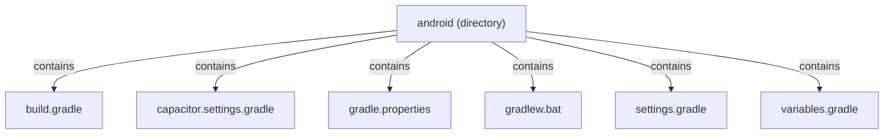

<!-- METADATA: {"source_path": "android", "source_sha": "33783949c4f562f70602e5aa4caba8d2196849bd", "extraction_quality": "full_ast", "model": "gpt-5-mini", "generated_at": "2026-08-11T22:51:11Z", "doc_type": "directory"} -->
[Documentation Home](../README.md) > [android](./README.md) > **android**

---

# android

> **Directory:** `android`

## Purpose

This directory contains the Gradle and Capacitor configuration and helper files used to build and configure the Android portion of the project. It centralizes project-level build settings, SDK/version variables, Gradle wrapper support for Windows, and module inclusion information needed for an Android build.

## Architecture Diagram

## Files

| File | Description |
| --- | --- |
| `build.gradle` | Top-level Gradle build script that configures the buildscript classpath and repositories (including Android Gradle plugin and Google Services), applies variables.gradle, sets repositories for subprojects, and defines a clean task that deletes the root build directory. |
| `capacitor.settings.gradle` | Gradle settings file that declares an included project with path ':capacitor-android' pointing to the Capacitor implementation under node_modules and contains a generated-file warning stating it is regenerated by the Capacitor CLI. |
| `gradle.properties` | Project-level Gradle properties file that sets JVM arguments for the Gradle daemon (e.g. max heap) and opts the project into AndroidX via android.useAndroidX, with comments and an example commented-out parallel setting. |
| `gradlew.bat` | Windows batch script for the Gradle wrapper that sets environment variables, resolves the script directory, defines default JVM options, locates a Java runtime, and launches the gradle-wrapper.jar with error handling for missing or invalid JAVA_HOME. |
| `settings.gradle` | Gradle settings file that declares included modules (such as ':app' and ':capacitor-cordova-android-plugins'), configures a plugin project's directory, and applies additional settings from 'capacitor.settings.gradle'. |
| `variables.gradle` | Gradle variables file that declares project-wide extra properties (inside an ext block) for Android SDK numbers and a set of dependency version strings intended for use by other Gradle scripts. |

## Subdirectories

Use these links to drill into the child directory READMEs for this section.

- [app](./app/README.md)

- [gradle](./gradle/README.md)

## Key Components

- **`Project-level build script`** (in `build.gradle`) — This file establishes the buildscript classpath, shared repositories for subprojects, and applies project-wide variables (variables.gradle), making it the central place for top-level Gradle configuration in this directory.
- **`Shared version variables`** (in `variables.gradle`) — Contains centralized SDK and dependency version properties intended to be referenced by other Gradle scripts so versioning and SDK targets remain consistent across the project.
- **`Module inclusion and plugin settings`** (in `settings.gradle`) — Declares which modules are part of the Android build and configures the location of an auxiliary plugin project; it also applies additional settings from capacitor.settings.gradle that affect included Capacitor components.
- **`Capacitor project mapping`** (in `capacitor.settings.gradle`) — Defines an included Capacitor Android project (':capacitor-android') pointing to the implementation under node_modules and carries a generated-file warning indicating it is managed by the Capacitor CLI, which is important for Cordova/Capacitor integration.

## Architecture Notes

Within this directory the top-level Gradle script (build.gradle) and the variables file (variables.gradle) are related in that the top-level build script is described as applying the variables file to share SDK and dependency versions across subprojects. Separately, settings.gradle controls which modules are included in the build (for example ':app' and ':capacitor-cordova-android-plugins') and is described as applying capacitor.settings.gradle, which itself declares the ':capacitor-android' project mapping and includes a generated-file warning.

Other files in the directory provide supporting configuration: gradle.properties holds global Gradle options such as JVM arguments and AndroidX opt-in, and gradlew.bat is the Windows Gradle wrapper script for launching Gradle. No other within-directory import or inheritance relationships were reported in the extracted summaries.

## Extraction Quality Note

Extraction used raw_source (or similar fallback) for all listed files (build.gradle, capacitor.settings.gradle, gradle.properties, gradlew.bat, settings.gradle, variables.gradle), so structural or syntactic details are approximate and based on summarized content rather than full parsed ASTs; consult the original files for exact syntax and complete contents.

---

## Navigation

**↑ Parent Directory:** [Go up](../README.md)
**🔗 Related:** [app](./app/README.md) • [gradle](./gradle/README.md)

---

This README was generated by [DocBot](https://github.com/marketplace/docbot-by-woden) from the structural analysis of the files in this directory. AI-generated content can contain mistakes — verify against the source code before acting on architectural claims.
