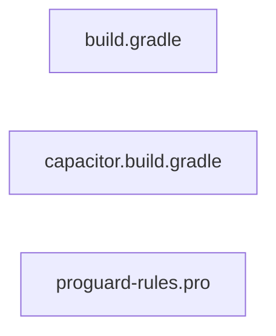

<!-- METADATA: {"source_path": "android/app", "source_sha": "c11df99952df14510955562ce9862ceec3c193f5", "extraction_quality": "full_ast", "model": "gpt-5-mini", "generated_at": "2026-08-11T22:46:42Z", "doc_type": "directory"} -->
[Documentation Home](../../README.md) > [android](../README.md) > [app](./README.md) > **app**

---

# app

> **Directory:** `android/app`

## Purpose

This directory contains the Android application module configuration files for the project. It holds Gradle build configuration, a generated Capacitor Gradle snippet, and ProGuard/R8 rules used during Android builds.

These files are primarily build- and packaging-related: they control SDK and Java compatibility, dependency declarations, release build settings, and obfuscation/shrinking rules for the Android app module.

## Architecture Diagram

## Files

| File | Description |
| --- | --- |
| `build.gradle` | This Gradle build script configures an Android application module. It sets up the Android namespace and SDK versions, default application settings (applicationId, min/target SDK, versionCode/versionName), test runner, and custom aaptOptions to ignore certain asset patterns. The script defines a release build type with proguard configuration, declares local flatDir repositories and multiple dependencies including AndroidX libraries, Capacitor projects, and test frameworks, … |
| `capacitor.build.gradle` | This Gradle build snippet is a generated Android module configuration for a Capacitor-based project. It configures Java compilation options to use Java 21 for both source and target compatibility, applies an external Gradle script for Cordova plugin variables, and provides placeholder blocks for dependencies and optional post-build extensions. The file includes a header warning that it is regenerated by the "capacitor update" process and should not be edited … |
| `proguard-rules.pro` | This file is an Android ProGuard/R8 configuration file intended to hold project-specific obfuscation and shrinking rules. It contains commented guidance and example rules for common needs such as keeping JavaScript interface members for WebView, preserving line number information for debugging, and renaming or hiding original source file names. The file is meant to be referenced by the proguardFiles setting in an Android Gradle build, allowing the build system to apply these … |

## Subdirectories

Use these links to drill into the child directory READMEs for this section.

- [src](./src/README.md)

## Key Components

- **`Module build configuration`** (in `build.gradle`) — This file controls the Android module's SDK targets, application identifiers, build types (including release proguard configuration), and dependency declarations—making it the central place to change how the app is built and which libraries are included.
- **`Capacitor/generated Gradle snippet`** (in `capacitor.build.gradle`) — This generated snippet sets Java compilation compatibility (Java 21) and holds Capacitor/Cordova plugin variable wiring and placeholders; because it is regenerated by the Capacitor tooling it is important for maintaining platform-specific settings produced by the framework.
- **`ProGuard/R8 rules`** (in `proguard-rules.pro`) — This file contains project-specific obfuscation and shrinking rules which affect release build output and runtime debugging/stack traces, so it is essential for controlling what is kept or removed during optimization.

## Architecture Notes

No within-directory imports or inheritance relationships were detected among these files. As a result, the files should be viewed as separate configuration artifacts that together describe how the Android application module is built: the build.gradle script configures the module and declares dependencies; capacitor.build.gradle is a generated snippet intended to provide Capacitor-related build settings and Java compatibility; and proguard-rules.pro holds obfuscation/shrinking rules that the build process may apply. There are no detected direct references or links between these files inside this directory based on the extraction data.

## Extraction Quality Note

All three files (build.gradle, capacitor.build.gradle, proguard-rules.pro) were extracted as raw_source; structural details (for example exact Gradle blocks or rule contents) are approximate and may not reflect the full original formatting or every internal declaration.

---

## Navigation

**↑ Parent Directory:** [Go up](../README.md)
**🔗 Related:** [src](./src/README.md)

---

This README was generated by [DocBot](https://github.com/marketplace/docbot-by-woden) from the structural analysis of the files in this directory. AI-generated content can contain mistakes — verify against the source code before acting on architectural claims.
