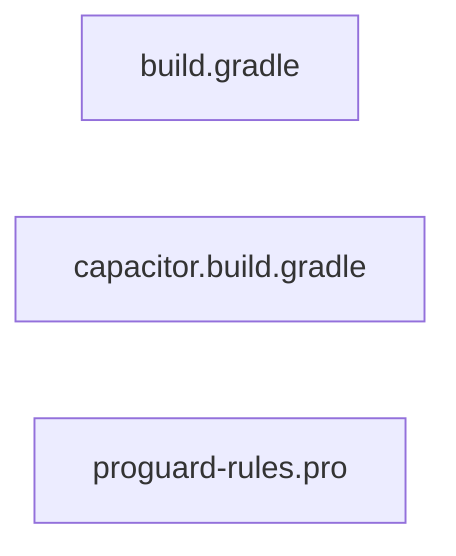

<!-- METADATA: {"source_path": "android/app", "source_sha": "c11df99952df14510955562ce9862ceec3c193f5", "extraction_quality": "full_ast", "model": "gpt-5-mini", "generated_at": "2026-08-11T22:48:15Z", "doc_type": "directory"} -->
[Documentation Home](../../README.md) > [android](../README.md) > [app](./README.md) > **app**

---

# app

> **Directory:** `android/app`

## Purpose

This directory contains the Android application module configuration and auxiliary build artifacts for an Android app in this codebase. It includes the primary Gradle build script for the app, a generated Capacitor Gradle snippet, and a ProGuard/R8 rules file used for code shrinking and obfuscation.

These files are focused on build configuration rather than application source: they control SDK and application settings, dependency declarations, Capacitor-related Java compilation options and regeneration behavior, and project-specific ProGuard rules used during release builds.

## Architecture Diagram

## Files

| File | Description |
| --- | --- |
| `build.gradle` | A Gradle build script that configures the Android application module: sets namespace and SDK versions, default application settings (applicationId, min/target SDK, versionCode/versionName), test runner, aaptOptions to ignore certain assets, a release build type with proguard configuration, local flatDir repositories, and declares multiple dependencies including AndroidX libraries, Capacitor projects, and test frameworks. |
| `capacitor.build.gradle` | A generated Gradle configuration snippet for a Capacitor-based project that configures Java compilation to use Java 21, applies an external Gradle script for Cordova plugin variables, and contains placeholder blocks for dependencies and optional post-build extensions; it includes a header warning that it is regenerated by the Capacitor update process and should not be edited. |
| `proguard-rules.pro` | An Android ProGuard/R8 configuration file intended to hold project-specific obfuscation and shrinking rules, containing commented guidance and example rules (for WebView JS interfaces, keeping line number information for debugging, and renaming or hiding original source file names) and meant to be referenced by proguardFiles in an Android Gradle build. |

## Subdirectories

Use these links to drill into the child directory READMEs for this section.

- [src](./src/README.md)

## Key Components

- **`App Gradle build script`** (in `build.gradle`) — This is the primary build configuration for the Android application module: it defines SDK targets, application identifiers and versions, build types (including release/proguard settings), and the dependency list that controls which libraries and plugins are included in the app.
- **`Capacitor Gradle snippet`** (in `capacitor.build.gradle`) — This generated snippet sets Java compilation options (Java 21 source/target in the extracted summary), applies Cordova plugin variable handling, and is regenerated by the Capacitor tooling—so it governs Capacitor-related build behavior and should not be edited manually.
- **`ProGuard/R8 rules file`** (in `proguard-rules.pro`) — This file holds project-specific obfuscation and shrinking directives that affect release builds; it provides the place to add rules needed to keep reflection-accessed members, debugging line numbers, or to control name obfuscation as referenced by the Gradle proguard configuration.

## Architecture Notes

The directory contains complementary build-related files rather than runtime source code. build.gradle is the main Gradle script that configures the Android app module, capacitor.build.gradle is a generated fragment focused on Capacitor and Java compilation options, and proguard-rules.pro is a configuration file intended for R8/ProGuard rules. No within-directory imports or inheritance relationships were detected in the extraction, so these files should be treated as separate configuration artifacts that the build system uses together at build time rather than as code that imports one another within this directory.

## Extraction Quality Note

Extraction for build.gradle, capacitor.build.gradle, and proguard-rules.pro used raw_source fallback; structural details (such as exact script blocks or specific dependency declarations) may be incomplete or approximate in the summaries.

---

## Navigation

**↑ Parent Directory:** [Go up](../README.md)
**🔗 Related:** [src](./src/README.md)

---

This README was generated by [DocBot](https://github.com/marketplace/docbot-by-woden) from the structural analysis of the files in this directory. AI-generated content can contain mistakes — verify against the source code before acting on architectural claims.
