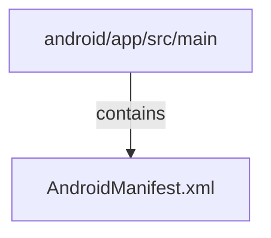

<!-- METADATA: {"source_path": "android/app/src/main", "source_sha": "36245ac96b92fc03b48decdfe87b33771a944f8a", "extraction_quality": "full_ast", "model": "gpt-5-mini", "generated_at": "2026-08-11T22:48:15Z", "doc_type": "directory"} -->
[Documentation Home](../../../../README.md) > [android](../../../README.md) > [app](../../README.md) > [src](../README.md) > [main](./README.md) > **main**

---

# main

> **Directory:** `android/app/src/main`

## Purpose

This directory holds the main Android application configuration for the app (application-level resources and metadata). Its primary purpose is to define how the Android system should start and expose the app, and to declare application-wide settings such as the application element, main activity, content providers, and required permissions.

The single file present is the AndroidManifest.xml which contains the manifest declarations the Android build system and runtime use to configure the installed app.

## Architecture Diagram

## Files

| File | Description |
| --- | --- |
| `AndroidManifest.xml` | This AndroidManifest.xml declares the application-level configuration for an Android app: it defines an <application> element with basic attributes (backup, icons, label, theme), registers a main activity (.MainActivity) configured as the LAUNCHER/MAIN entry point, declares an androidx.core.content.FileProvider with associated file paths metadata, and requests the INTERNET permission. |

## Subdirectories

Use these links to drill into the child directory READMEs for this section.

- [java](./java/README.md)

- [res](./res/README.md)

## Key Components

- **`Application element`** (in `AndroidManifest.xml`) — The <application> element in the manifest defines global app metadata (icons, theme, backup settings) that affect how the app appears and behaves at runtime and during installation; it is the primary container for the app-level configuration in this directory.
- **`Main activity entry`** (in `AndroidManifest.xml`) — The registered main activity (noted as .MainActivity in the manifest) and its launcher/MAIN intent filter determine the app's entry point and how the app is started from the device launcher, making it critical for app launch behavior.
- **`FileProvider and permissions`** (in `AndroidManifest.xml`) — The declared androidx.core.content.FileProvider and the requested INTERNET permission indicate how the app exposes files to other apps and what network capability the app requests; these declarations govern security and capability boundaries for the application.

## Architecture Notes

This directory contains a single AndroidManifest.xml file which is the authoritative source of application-level configuration for the Android app. No other files were detected in this directory, and no within-directory imports or inheritance relationships were reported by the extraction, so the manifest stands alone here as the configuration artifact.

Because only the manifest file is present under this path, the runtime and build relationships implied (application metadata, activity entry point, FileProvider, and permission) are declared in this single file rather than expressed through cross-file references within the same directory.

## Extraction Quality Note

The AndroidManifest.xml file was extracted with raw_source; structural details (exact XML element nesting, attribute values, and fully qualified names) should be treated as approximate and are based on the provided summary rather than a parsed AST.

---

## Navigation

**↑ Parent Directory:** [Go up](../README.md)
**🔗 Related:** [java](./java/README.md) • [res](./res/README.md)

---

This README was generated by [DocBot](https://github.com/marketplace/docbot-by-woden) from the structural analysis of the files in this directory. AI-generated content can contain mistakes — verify against the source code before acting on architectural claims.
