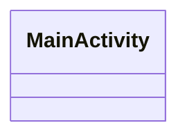

<!-- METADATA: {"source_path": "android/app/src/main/java/com/c728/voidrepodocs", "source_sha": "06e900c81ad688099a372fee936ccfe17ae18e92", "extraction_quality": "full_ast", "model": "gpt-5-mini", "generated_at": "2026-08-11T22:48:15Z", "doc_type": "directory"} -->
[Documentation Home](../../../../../../../../README.md) > [android](../../../../../../../README.md) > [app](../../../../../../README.md) > [src](../../../../../README.md) > [main](../../../../README.md) > [java](../../../README.md) > [com](../../README.md) > [c728](../README.md) > [voidrepodocs](./README.md) > **voidrepodocs**

---

# voidrepodocs

> **Directory:** `android/app/src/main/java/com/c728/voidrepodocs`

## Purpose

This directory holds the Android-side Java sources for the app's main package and appears to contain the application's entry point activity for the Android platform. Its contents are minimal (a single source file) and are oriented toward connecting the app runtime to platform infrastructure.

## Architecture Diagram

## Files

| File | Description |
| --- | --- |
| `MainActivity.java` | Declares a single Android activity class named MainActivity and imports the Capacitor BridgeActivity type from com.getcapacitor; the extracted summary does not include method implementations or lifecycle overrides. |

## Key Components

- **`MainActivity (activity class)`** (in `MainActivity.java`) — According to the extracted summary, this is the primary Android activity declared in the directory and therefore represents the package's main entry point on Android; it is the first place to look when understanding how the app boots or ties into the Android lifecycle.
- **`BridgeActivity import (Capacitor integration point)`** (in `MainActivity.java`) — The file's summary indicates an import of com.getcapacitor.BridgeActivity, which signals integration with Capacitor infrastructure; understanding this import helps explain how the activity may delegate runtime bridging responsibilities to the Capacitor library (note: implementation details are not present in the extracted summary).

## Architecture Notes

No within-directory imports or inheritance were detected in the extraction, and the directory contains only a single Java source file. Because there are no detected internal relationships between files in this directory, the file stands alone within this package as the apparent Android activity entrypoint.

## Extraction Quality Note

MainActivity.java was extracted using regex_fallback; the extraction may be incomplete and details such as method implementations, overrides, and other class members are not available from the provided summary.

---

## Navigation

**↑ Parent Directory:** [Go up](../README.md)

---

This README was generated by [DocBot](https://github.com/marketplace/docbot-by-woden) from the structural analysis of the files in this directory. AI-generated content can contain mistakes — verify against the source code before acting on architectural claims.
