<!-- METADATA: {"source_path": "components/ui", "source_sha": "1e1880a437b5b4ed93d34997c613ee9e25b9b3e5", "extraction_quality": "full_ast", "model": "gpt-5-mini", "generated_at": "2026-08-11T22:56:20Z", "doc_type": "directory"} -->
[Documentation Home](../../README.md) > [components](../README.md) > [ui](./README.md) > **ui**

---

# ui

> **Directory:** `components/ui`

## Purpose

This directory contains small TypeScript React wrapper components that standardize and compose UI primitives from underlying libraries into application-specific building blocks. The modules primarily adapt external primitives (dialogs, selects, inputs, buttons, scroll areas, cards, and toast toasts) and apply shared class-name composition and theming patterns so the rest of the app can use consistent, higher-level UI elements.

Files here are thin adapters and composition helpers rather than standalone complex subsystems: they expose named components and subcomponents for common UI patterns (dialogs, selects, cards, scroll areas, buttons, inputs, and toast/toaster integration) to keep UI usage consistent across the codebase.

## Architecture Diagram

```mermaid
flowchart TD
  button_tsx["button.tsx"]
  button_tsx -->|exports| Button["Button"]

  card_tsx["card.tsx"]
  card_tsx -->|exports| Card["Card"]
  card_tsx -->|exports| CardHeader["CardHeader"]
  card_tsx -->|exports| CardTitle["CardTitle"]
  card_tsx -->|exports| CardDescription["CardDescription"]
  card_tsx -->|exports| CardAction["CardAction"]
  card_tsx -->|exports| CardContent["CardContent"]
  card_tsx -->|exports| CardFooter["CardFooter"]

  dialog_tsx["dialog.tsx"]
  dialog_tsx -->|exports| Dialog["Dialog"]
  dialog_tsx -->|exports| DialogTrigger["DialogTrigger"]
  dialog_tsx -->|exports| DialogPortal["DialogPortal"]
  dialog_tsx -->|exports| DialogClose["DialogClose"]
  dialog_tsx -->|exports| DialogOverlay["DialogOverlay"]
  dialog_tsx -->|exports| DialogContent["DialogContent"]
  dialog_tsx -->|exports| DialogHeader["DialogHeader"]
  dialog_tsx -->|exports| DialogFooter["DialogFooter"]
  dialog_tsx -->|exports| DialogTitle["DialogTitle"]
  dialog_tsx -->|exports| DialogDescription["DialogDescription"]

  input_tsx["input.tsx"]
  input_tsx -->|exports| Input["Input"]

  scroll_area_tsx["scroll-area.tsx"]
  scroll_area_tsx -->|exports| ScrollArea["ScrollArea"]
  scroll_area_tsx -->|exports| ScrollBar["ScrollBar"]

  select_tsx["select.tsx"]
  select_tsx -->|exports| SelectGroup["SelectGroup"]
  select_tsx -->|exports| SelectValue["SelectValue"]
  select_tsx -->|exports| SelectTrigger["SelectTrigger"]
  select_tsx -->|exports| SelectContent["SelectContent"]
  select_tsx -->|exports| SelectLabel["SelectLabel"]
  select_tsx -->|exports| SelectItem["SelectItem"]
  select_tsx -->|exports| SelectSeparator["SelectSeparator"]
  select_tsx -->|exports| SelectScrollUpButton["SelectScrollUpButton"]
  select_tsx -->|exports| SelectScrollDownButton["SelectScrollDownButton"]

  sonner_tsx["sonner.tsx"]
```

## Files

| File | Description |
| --- | --- |
| `dialog.tsx` | Defines a set of React wrapper components for building dialogs by re-exporting or composing primitives from an underlying dialog library into named module-level functions such as Dialog, DialogTrigger, DialogContent, DialogTitle, and others; it also uses a class-name utility and other UI pieces like a Button and an XIcon (summary information is approximate due to extraction fallback). |
| `select.tsx` | Provides React wrapper components around a Select primitive from an external UI library, exposing multiple small components (trigger, content, items, labels, groups, separators, scroll buttons, etc.) to compose accessible dropdown/select controls. |
| `card.tsx` | Exports a set of functional Card components and common subcomponents (Card, CardHeader, CardTitle, CardDescription, CardAction, CardContent, CardFooter) intended for composing card layouts and using a shared class-name utility (summary details are approximate due to extraction fallback). |
| `scroll-area.tsx` | Defines ScrollArea and ScrollBar React components by wrapping primitives from an external scroll-area library, providing standardized scrollable areas and scroll bars for reuse across the app (details are thin adapters per the extraction). |
| `button.tsx` | Defines a single exported Button component that wraps an underlying primitive button, combining variant-driven styling with a class-name utility to produce a configurable, typed React button (specific implementation details are approximate because of extraction fallback). |
| `input.tsx` | Provides a thin wrapper component Input around a primitive input component from an external package, centralizing how the base input is used and applying shared class-name composition (summary is approximate due to extraction fallback). |
| `sonner.tsx` | Integrates the Sonner toast library with theming and iconography by adapting Sonner's Toaster (and its props) to the application's theme and supplying icons for different toast states (summary information is approximate due to extraction fallback). |

## Key Components

- **`Dialog components`** (in `dialog.tsx`) — Dialog primitives are central for creating modals and overlays used throughout an app; this module consolidates the dialog API and presentation patterns (triggering, overlay, content, header/footer, title/description) so other parts of the UI can implement consistent modal behavior.
- **`Button`** (in `button.tsx`) — The Button component defines the shared variant-driven styling and typing for interactive actions; because buttons are used widely, having a single, styled wrapper ensures visual and behavioral consistency across components and pages.
- **`Select components`** (in `select.tsx`) — Select and its subcomponents encapsulate accessible dropdown behavior and composition patterns (triggers, items, groups, scroll controls), providing a reusable building block for form controls and dropdown lists across the app.
- **`Sonner toast integration`** (in `sonner.tsx`) — Toasts are a common cross-cutting concern for user feedback; this module adapts the Sonner Toaster to the app's theming and iconography so notification behavior and appearance are consistent.

## Architecture Notes

No within-directory imports or inheritance relationships were detected in the extracted metadata, so these files should be understood as a collection of independent wrapper modules rather than a tightly coupled internal hierarchy. Each file adapts primitives from external libraries (dialogs, selects, inputs, buttons, scroll areas, cards, and toast) into small, focused React components that standardize styling and composition for the rest of the codebase.

Because there are no detected internal imports between these modules, they can be used independently or composed at the application level; the directory acts as a palette of standardized UI adapters rather than a layered subsystem with internal module dependencies.

## Extraction Quality Note

Extraction used a regex_fallback for multiple files (dialog.tsx, select.tsx, card.tsx, scroll-area.tsx, button.tsx, input.tsx, sonner.tsx), so specific implementation details, exact prop signatures, and class names are approximate and were not reconstructed reliably from source.

---

## Navigation

**↑ Parent Directory:** [Go up](../README.md)

---

This README was generated by [DocBot](https://github.com/marketplace/docbot-by-woden) from the structural analysis of the files in this directory. AI-generated content can contain mistakes — verify against the source code before acting on architectural claims.
