<!-- METADATA: {"source_path": "components/ui", "source_sha": "1e1880a437b5b4ed93d34997c613ee9e25b9b3e5", "extraction_quality": "full_ast", "model": "gpt-5-mini", "generated_at": "2026-08-11T22:57:24Z", "doc_type": "directory"} -->
[Documentation Home](../../README.md) > [components](../README.md) > [ui](./README.md) > **ui**

---

# ui

> **Directory:** `components/ui`

## Purpose

This directory contains a set of React UI wrapper components implemented in TypeScript. The modules standardize how underlying UI primitives (dialogs, selects, cards, inputs, buttons, scroll areas, and toasts) are used across the codebase by providing small, composable wrappers and integration points.

## Architecture Diagram

```mermaid
flowchart TD
  button_tsx["button.tsx"]
  button_tsx -->|exports| Button["Button"]

  card_tsx["card.tsx"]
  card_tsx -->|exports| Card["Card"]
  card_tsx -->|exports| CardHeader["CardHeader"]
  card_tsx -->|exports| CardTitle["CardTitle"]
  card_tsx -->|exports| CardDescription["CardDescription"]
  card_tsx -->|exports| CardAction["CardAction"]
  card_tsx -->|exports| CardContent["CardContent"]
  card_tsx -->|exports| CardFooter["CardFooter"]

  dialog_tsx["dialog.tsx"]
  dialog_tsx -->|exports| Dialog["Dialog"]
  dialog_tsx -->|exports| DialogTrigger["DialogTrigger"]
  dialog_tsx -->|exports| DialogPortal["DialogPortal"]
  dialog_tsx -->|exports| DialogClose["DialogClose"]
  dialog_tsx -->|exports| DialogOverlay["DialogOverlay"]
  dialog_tsx -->|exports| DialogContent["DialogContent"]
  dialog_tsx -->|exports| DialogHeader["DialogHeader"]
  dialog_tsx -->|exports| DialogFooter["DialogFooter"]
  dialog_tsx -->|exports| DialogTitle["DialogTitle"]
  dialog_tsx -->|exports| DialogDescription["DialogDescription"]

  input_tsx["input.tsx"]
  input_tsx -->|exports| Input["Input"]

  scroll_area_tsx["scroll-area.tsx"]
  scroll_area_tsx -->|exports| ScrollArea["ScrollArea"]
  scroll_area_tsx -->|exports| ScrollBar["ScrollBar"]

  select_tsx["select.tsx"]
  select_tsx -->|exports| SelectGroup["SelectGroup"]
  select_tsx -->|exports| SelectValue["SelectValue"]
  select_tsx -->|exports| SelectTrigger["SelectTrigger"]
  select_tsx -->|exports| SelectContent["SelectContent"]
  select_tsx -->|exports| SelectLabel["SelectLabel"]
  select_tsx -->|exports| SelectItem["SelectItem"]
  select_tsx -->|exports| SelectSeparator["SelectSeparator"]
  select_tsx -->|exports| SelectScrollUpButton["SelectScrollUpButton"]
  select_tsx -->|exports| SelectScrollDownButton["SelectScrollDownButton"]

  sonner_tsx["sonner.tsx"]
```

## Files

| File | Description |
| --- | --- |
| `dialog.tsx` | Re-exports and composes primitives from an underlying dialog library into a set of named wrapper components (Dialog, DialogTrigger, DialogPortal, DialogClose, DialogOverlay, DialogContent, DialogHeader, DialogFooter, DialogTitle, and DialogDescription) and imports utilities such as a class-name helper, a Button, and an icon. |
| `select.tsx` | Provides a group of React wrapper components around a Select primitive from an external UI library, exposing focused building blocks like trigger, content, items, labels, groups, separators, and scroll buttons for building accessible dropdown/select controls. |
| `card.tsx` | Defines a set of functional React components implementing a Card primitive and common subcomponents (Card, CardHeader, CardTitle, CardDescription, CardAction, CardContent, and CardFooter) intended for composing card layouts. |
| `scroll-area.tsx` | Defines two React components, ScrollArea and ScrollBar, as thin wrappers around primitives from an external scroll-area library to standardize scrollable areas and scroll bars. |
| `button.tsx` | Exports a single Button component that wraps an underlying primitive button and applies variant-driven styling (via a variant utility) together with a class-name helper to produce a configurable, typed React button element. |
| `input.tsx` | Defines an Input component that serves as a thin wrapper around a primitive input component from an external library, applying shared class-name composition logic before rendering. |
| `sonner.tsx` | Integrates the Sonner toast library with theming and iconography by adapting Sonner's Toaster props and supplying theme-aware icons and configuration for toast states. |

## Key Components

- **`Dialog set`** (in `dialog.tsx`) — This file groups many related dialog subcomponents together (trigger, content, overlay, header/footer, title/description, etc.), making it the primary place to look for modal-related building blocks and consistent dialog behaviors/styling used by the app.
- **`Select primitives`** (in `select.tsx`) — The Select wrappers expose the small composable pieces required to build accessible dropdowns and option lists; knowing these components is important when constructing or customizing form controls or dropdown-based UIs.
- **`Button`** (in `button.tsx`) — The Button component centralizes variant-driven styling and typing for clickable controls, so it is a core primitive developers will reuse widely for consistent buttons across the UI.
- **`Sonner integration`** (in `sonner.tsx`) — This module adapts the toast system to the application's theming and icon set, making it the place to change global toast behavior, appearance, or iconography for user notifications.

## Architecture Notes

The files in this directory are presented as a collection of independent wrapper modules: each file wraps or composes primitives from external UI libraries into smaller, application-specific React components. No within-directory imports or inheritance relationships were detected in the extraction, so these modules appear to be standalone adapters rather than a tightly coupled internal component hierarchy.

Each module exposes a focused set of exports (often a primary component plus small subcomponents) intended to be composed by application code. The general pattern is lightweight adapters around external primitives to centralize styling, accessibility decisions, and small integration details (for example, variant-driven button styling or toast theming), while leaving composition and cross-component usage to the rest of the codebase.

## Extraction Quality Note

Extraction used regex_fallback for several files (button.tsx, card.tsx, dialog.tsx, input.tsx, scroll-area.tsx, select.tsx, sonner.tsx); structural details such as exact class names, prop types, and method signatures may be approximate or incomplete.

---

## Navigation

**↑ Parent Directory:** [Go up](../README.md)

---

This README was generated by [DocBot](https://github.com/marketplace/docbot-by-woden) from the structural analysis of the files in this directory. AI-generated content can contain mistakes — verify against the source code before acting on architectural claims.
