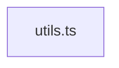

<!-- METADATA: {"source_path": "lib", "source_sha": "a6ffcb31c9a19316bde33c7c4dab13783ff631eb", "extraction_quality": "full_ast", "model": "gpt-5-mini", "generated_at": "2026-08-11T22:57:24Z", "doc_type": "directory"} -->
[Documentation Home](../README.md) > [lib](./README.md) > **lib**

---

# lib

> **Directory:** `lib`

## Purpose

This directory contains small reusable utilities intended to help with CSS class name composition and normalization for UI components, particularly in projects that use Tailwind CSS. The utilities centralize how class strings are built and merged so components can rely on a consistent, composable approach for class name handling.

## Architecture Diagram

## Files

| File | Description |
| --- | --- |
| `utils.ts` | A small utilities module that appears to provide helpers related to CSS class name composition and Tailwind CSS merging, importing clsx (and its ClassValue type) and twMerge from tailwind-merge; the file may re-export or wrap those helpers. |

## Key Components

- **`class name composition helper`** (in `utils.ts`) — This component (in utils.ts) is the place where class strings are composed or normalized for UI components, so it directly affects how components combine static and conditional classes and ensures consistent class generation across the codebase.
- **`Tailwind merge integration`** (in `utils.ts`) — This component (in utils.ts) wraps or exposes tailwind-merge functionality so that conflicting Tailwind utility classes are resolved in a single, centralized location, which helps prevent class duplication or ordering issues in the UI.

## Architecture Notes

The lib directory is small and contains the utilities module utils.ts. No within-directory imports or inheritance were detected, so files in this directory are treated as standalone utilities rather than forming a layered internal dependency graph. Given the single-file contents, consumers elsewhere in the codebase would import directly from this module to access class composition and Tailwind merge helpers.

## Extraction Quality Note

The file utils.ts was extracted using regex_fallback; the summary is approximate and may not list exact exported functions, signatures, or full internal structure, so implementation details should be verified from the source.

---

## Navigation

**↑ Parent Directory:** [Go up](../README.md)

---

This README was generated by [DocBot](https://github.com/marketplace/docbot-by-woden) from the structural analysis of the files in this directory. AI-generated content can contain mistakes — verify against the source code before acting on architectural claims.
