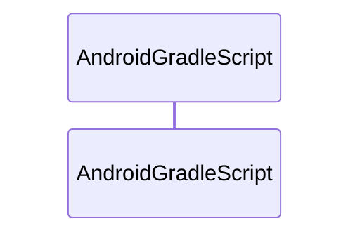

<!-- METADATA: {"source_path": "scripts", "source_sha": "2c488484fd3baff272abd9595eacf72aee52f337", "extraction_quality": "full_ast", "model": "gpt-5-mini", "generated_at": "2026-08-11T22:57:24Z", "doc_type": "directory"} -->
[Documentation Home](../README.md) > [scripts](./README.md) > **scripts**

---

# scripts

> **Directory:** `scripts`

## Purpose

This directory contains helper scripts used to prepare and invoke Android Gradle builds from a host machine. The scripts probe the local environment for required tooling (Java JDK and Android SDK), set environment variables, and then invoke the Gradle wrapper with a provided task name.

The scripts are intended to be small, self-contained PowerShell helpers to make invoking Android Gradle tasks more reliable across different host setups by locating common installation locations and setting JAVA_HOME and related environment variables before running the wrapper.

## Architecture Diagram

## Files

| File | Description |
| --- | --- |
| `android-gradle.ps1` | This PowerShell script is a small helper that locates a suitable Java JDK and Android SDK on the host machine, sets environment variables accordingly, and invokes the Android Gradle wrapper with a task name passed as a mandatory parameter. It defines two helper functions, Find-JavaHome and Find-AndroidSdk, which probe a list of candidate paths (including common installation locations and environment variables) and return the first valid path found. After setting JAVA_HOME … |

## Key Components

- **`Android Gradle helper script`** (in `android-gradle.ps1`) — This is the primary script in the directory; it orchestrates locating the required JDK/SDK, sets environment variables and invokes the Android Gradle wrapper so builds can run consistently on different machines.
- **`Find-JavaHome helper`** (in `android-gradle.ps1`) — This helper (described in the file summary) encapsulates the logic for probing candidate Java JDK installation locations and returning a usable JAVA_HOME, which is critical for any Java/Gradle-based build.
- **`Find-AndroidSdk helper`** (in `android-gradle.ps1`) — This helper (described in the file summary) encapsulates the probing of candidate Android SDK locations and returns a valid sdk path, ensuring the Gradle build has access to the Android SDK tools it needs.

## Architecture Notes

This directory contains a single PowerShell script and no detected within-directory imports or inheritance relationships; the file is standalone. The script itself contains the helpers and the invocation flow described in its summary, and there are no other files in this directory that it depends on according to the extraction data.

Because only one file is present and no cross-file relationships were detected, the architectural surface is simple: the script locates tools, sets environment variables, and runs the Gradle wrapper as a self-contained unit.

## Extraction Quality Note

The file android-gradle.ps1 was extracted from raw_source; structural details beyond the provided summary (for example exact function signatures or internal branching) may be incomplete or approximate.

---

## Navigation

**↑ Parent Directory:** [Go up](../README.md)

---

This README was generated by [DocBot](https://github.com/marketplace/docbot-by-woden) from the structural analysis of the files in this directory. AI-generated content can contain mistakes — verify against the source code before acting on architectural claims.
