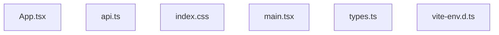

<!-- METADATA: {"source_path": "src", "source_sha": "9546b4896952f3d4a8634ad70383fbd21a020295", "extraction_quality": "full_ast", "model": "gpt-5-mini", "generated_at": "2026-08-11T22:59:07Z", "doc_type": "directory"} -->
[Documentation Home](../README.md) > [src](./README.md) > **src**

---

# src

> **Directory:** `src`

## Purpose

This src directory contains the primary client-side source for a TypeScript React application plus a global stylesheet and type declarations. The files include UI component code, type definitions, a small API-related module, an application entrypoint, and global CSS that defines theme and typographic rules.

## Architecture Diagram

## Files

| File | Description |
| --- | --- |
| `api.ts` | A TypeScript module that imports Capacitor from @capacitor/core and axios as an HTTP client; the file appears intended to coordinate between Capacitor's native-capability bridge and axios-based network requests, although no concrete functions or classes were extracted. |
| `App.tsx` | A TypeScript React file that appears to be a UI-focused component composing an interface for generating or displaying content, using React hooks, animation helpers, markdown rendering, toast notifications, and a set of custom UI primitives according to the extracted summary. |
| `index.css` | A CSS source that defines a global visual theme and typography rules, imports Tailwind and Google fonts, declares many custom CSS variables for colors, fonts and radii, and applies base styles and a .markdown-body block using Tailwind utility directives according to the extracted summary. |
| `main.tsx` | A TypeScript entry file that serves as the client-side bootstrap for a React application; the summary indicates it imports a top-level App component, applies a global stylesheet, and mounts the application via React's createRoot API. |
| `types.ts` | A TypeScript module defining enums, string unions, and interfaces that describe document generation requests and responses for a tool that can produce various repository or app documents, enumerating supported document types, target platforms, tones, lengths, and provider-related types. |
| `vite-env.d.ts` | A TypeScript declaration file that brings Vite's client-side type definitions into the project's compilation context via a triple-slash reference to "vite/client", enabling Vite-specific globals and types in the TypeScript compilation. |

## Subdirectories

Use these links to drill into the child directory READMEs for this section.

- [components](./components/README.md)

## Key Components

- **`Top-level UI (App)`** (in `App.tsx`) — App.tsx is the primary UI-focused component described by the extraction and therefore is likely where the user-facing interface is composed and local UI primitives and libraries are orchestrated; understanding this file is important to see how the app presents content and interacts with users.
- **`Type Definitions`** (in `types.ts`) — types.ts defines the enums, unions, and interfaces used to model document generation requests and responses; these types are central for understanding the data shapes the rest of the codebase is intended to produce or consume.
- **`Global Styles`** (in `index.css`) — index.css establishes the application's visual theme, typography, and a markdown-specific stylesheet (.markdown-body), so it is key for any visual or typographic changes and for ensuring rendered markdown looks consistent.
- **`API bridge`** (in `api.ts`) — api.ts imports Capacitor and axios and therefore appears to be the intended place for implementing network requests and platform-aware/native-capability interactions; it is important for adding or modifying how the app communicates with external services or device APIs.

## Architecture Notes

The files in this directory represent distinct pieces of a typical client-side application: a UI component (App.tsx), a bootstrap entry (main.tsx), a styling layer (index.css), type declarations (types.ts), an API-related module (api.ts), and a Vite ambient types file (vite-env.d.ts). Based on the provided extraction summaries these are complementary assets that together would support a React application with typed data models, styling, and network/native interaction responsibilities. However, no within-directory imports or inheritance relationships were detected by the extraction step, so concrete import links or file-to-file dependencies within this directory are not confirmed by the available metadata and must not be assumed.

## Extraction Quality Note

Several files were extracted with lower-fidelity methods (regex_fallback or raw_source): api.ts, App.tsx, index.css, main.tsx, types.ts, and vite-env.d.ts. Structural details (such as exact exports, function signatures, or class/method definitions) may be incomplete or approximate in the summaries above.

---

## Navigation

**↑ Parent Directory:** [Go up](../README.md)
**🔗 Related:** [components](./components/README.md)

---

This README was generated by [DocBot](https://github.com/marketplace/docbot-by-woden) from the structural analysis of the files in this directory. AI-generated content can contain mistakes — verify against the source code before acting on architectural claims.
