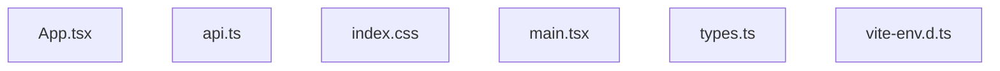

<!-- METADATA: {"source_path": "src", "source_sha": "9546b4896952f3d4a8634ad70383fbd21a020295", "extraction_quality": "full_ast", "model": "gpt-5-mini", "generated_at": "2026-08-11T22:58:05Z", "doc_type": "directory"} -->
[Documentation Home](../README.md) > [src](./README.md) > **src**

---

# src

> **Directory:** `src`

## Purpose

This src directory contains the primary source files for a TypeScript React application with associated global styles and type declarations. The collection includes an application UI component, an entrypoint bootstrap, API-related utilities, shared TypeScript types used for document generation, a global CSS theme, and a Vite type declaration helper.

## Architecture Diagram

## Files

| File | Description |
| --- | --- |
| `api.ts` | This TypeScript module imports Capacitor from the @capacitor/core package and axios as an HTTP client and appears intended to coordinate between Capacitor's native-capability bridge and axios-based network requests, although no classes, functions, or methods are present in the extracted summary. |
| `App.tsx` | This TypeScript React file appears to be a UI-focused component that composes a user interface for generating or displaying content, leveraging several React ecosystem libraries and locally defined types according to the extracted summary. |
| `index.css` | This CSS source defines a global visual theme and typography rules for an application, including imported fonts, many custom CSS variables for colors, fonts and radii, base body styles, and targeted markdown-body styles using Tailwind utility patterns. |
| `main.tsx` | This TypeScript entry file serves as the client-side bootstrap for a React application; the extracted summary indicates it imports a top-level App component, applies a global stylesheet, and mounts the application into the DOM using React's createRoot API and StrictMode. |
| `types.ts` | This TypeScript module defines enums, string unions, and interfaces that describe document generation requests and responses for a tool that can produce various repository or app documents, enumerating supported document types, target platforms, tones, lengths, provider types, and related key shapes. |
| `vite-env.d.ts` | This TypeScript declaration file brings Vite's client-side type definitions into the project's compilation context via a triple-slash reference directive to 'vite/client', allowing TypeScript to recognize Vite-specific globals and types during compilation. |

## Subdirectories

Use these links to drill into the child directory READMEs for this section.

- [components](./components/README.md)

## Key Components

- **`App (UI component)`** (in `App.tsx`) — App.tsx is the primary user-interface component described in this directory and is where UI composition, interactions, and integration with UI libraries are likely implemented, making it central to understanding the app's front-end behavior.
- **`Shared types`** (in `types.ts`) — types.ts defines the enums, unions, and interfaces for document generation requests and responses; these type definitions are important for understanding the data shapes and contracts used across the application code.
- **`Global styles`** (in `index.css`) — index.css declares the application's visual theme, typography tokens, and detailed markdown styling rules, so it controls the baseline look-and-feel and markdown rendering styles used throughout the app.
- **`API utilities placeholder`** (in `api.ts`) — api.ts imports Capacitor and axios and thus appears to be the place intended for platform-aware networking or native-bridge logic; it is the likely location for any HTTP or native-capability glue code in the src directory.

## Architecture Notes

The extraction did not report any within-directory import or inheritance relationships, so the files should be treated as a set of independent source artifacts rather than asserting concrete import links between them. Based on the extracted summaries, the directory contains an application UI component (App.tsx), an entry bootstrap (main.tsx), a stylesheet (index.css), API-related code (api.ts), shared TypeScript types (types.ts), and a Vite type declaration helper (vite-env.d.ts); however, no explicit in-directory connections were detected by the extraction, so any runtime wiring or imports between these files are not confirmed here.

## Extraction Quality Note

Extraction used regex_fallback or raw_source for api.ts, App.tsx, index.css, main.tsx, types.ts, and vite-env.d.ts, so structural details (exact functions, classes, or imports) are incomplete or hedged and should be verified against the original source files.

---

## Navigation

**↑ Parent Directory:** [Go up](../README.md)
**🔗 Related:** [components](./components/README.md)

---

This README was generated by [DocBot](https://github.com/marketplace/docbot-by-woden) from the structural analysis of the files in this directory. AI-generated content can contain mistakes — verify against the source code before acting on architectural claims.
