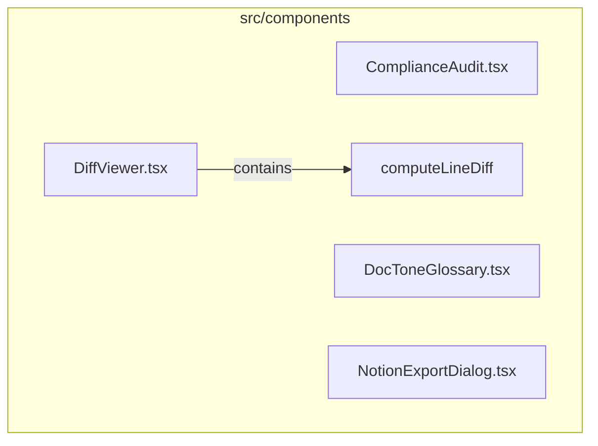

<!-- METADATA: {"source_path": "src/components", "source_sha": "82e4d8ea401ceaaa31187fb11c1081fce5c68b09", "extraction_quality": "full_ast", "model": "gpt-5-mini", "generated_at": "2026-08-11T22:59:07Z", "doc_type": "directory"} -->
[Documentation Home](../../README.md) > [src](../README.md) > [components](./README.md) > **components**

---

# components

> **Directory:** `src/components`

## Purpose

This directory contains TypeScript React components that provide UI features used across the application, including a diff viewer, a compliance audit view, a document tone/type glossary selector, and a dialog for exporting data to Notion. The components use React hooks and compose shared UI primitives and iconography to implement interactive controls and user feedback flows.

## Architecture Diagram

## Files

| File | Description |
| --- | --- |
| `DiffViewer.tsx` | This TypeScript file defines a React component module for displaying and interacting with line-by-line diffs and includes logic (e.g. computeLineDiff) to compute differences between lines of text and UI affordances such as copying and other interactions. |
| `ComplianceAudit.tsx` | This TypeScript file defines a React UI component related to a compliance audit view that composes status and informational icons together with a shared Button component and appears to use memoization to avoid unnecessary recalculations. |
| `DocToneGlossary.tsx` | This TypeScript file defines a React component that appears to implement a searchable glossary or selection UI for document tones and types, using hooks to manage state and memoized computations and referencing application-specific types DocumentType and Tone. |
| `NotionExportDialog.tsx` | This TypeScript file defines a React component (NotionExportDialog) that provides a UI for exporting data to Notion, using state and effect hooks, composing UI elements from a design system, and interacting with a backend while surfacing user feedback with toast notifications. |

## Key Components

- **`DiffViewer`** (in `DiffViewer.tsx`) — DiffViewer provides the primary UI and logic for presenting and interacting with line-by-line text differences, and it contains the computeLineDiff logic that is central to any change-review workflows in this directory.
- **`NotionExportDialog`** (in `NotionExportDialog.tsx`) — NotionExportDialog is the integration point for exporting application data to Notion, handling user inputs, backend interaction, and user-facing notifications, so it governs an important external data flow that consumers of these components may rely on.
- **`DocToneGlossary`** (in `DocToneGlossary.tsx`) — DocToneGlossary implements the searchable/selection UI around document tones and types, making it a key piece for content classification or authoring flows where users pick tone or document type metadata.
- **`ComplianceAudit`** (in `ComplianceAudit.tsx`) — ComplianceAudit surfaces audit-related status and informational UI that supports compliance review or display workflows, providing a focused view for compliance-related state within the UI set represented in this directory.

## Architecture Notes

All four files are standalone React component modules implemented in TypeScript. The extraction did not detect any within-directory imports or inheritance relationships among these files, so they should be treated as independent components rather than a tightly coupled module graph. Each component composes external dependencies such as React hooks, icon libraries, and shared UI primitives, which suggests they are intended to be used individually or wired together by higher-level application code outside this directory.

## Extraction Quality Note

Extraction used regex_fallback for DiffViewer.tsx, ComplianceAudit.tsx, DocToneGlossary.tsx, and NotionExportDialog.tsx, so structural details (exports, props, and exact function signatures) may be incomplete or imprecise and should be verified against the source files.

---

## Navigation

**↑ Parent Directory:** [Go up](../README.md)

---

This README was generated by [DocBot](https://github.com/marketplace/docbot-by-woden) from the structural analysis of the files in this directory. AI-generated content can contain mistakes — verify against the source code before acting on architectural claims.
