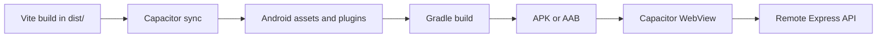

# Android Build and Release

VOID's Android application is a Capacitor shell around the Vite frontend. The UI is packaged into
the APK; AI requests go to a remote Express API. The phone is not secretly running Node.js in its
pocket, which is comforting for several reasons.

## Architecture



`capacitor.config.ts` defines:

```text
appId: com.c728.voidrepodocs
appName: VOID Repo Docs
webDir: dist
```

`src/api.ts` uses this default API for native platforms:

```text
https://void-repository-documents-320691612506.us-west2.run.app
```

Set `VITE_API_BASE_URL` before building to use another deployment.

## Requirements

- Node.js and npm.
- Android Studio.
- Android SDK platform tools.
- JDK 17 or newer.
- PowerShell.

The helper script searches for Java in:

1. `JAVA_HOME`
2. Android Studio `jbr`
3. Android Studio `jre`
4. `C:\Program Files\Java\latest`

It searches for the SDK in:

1. `ANDROID_SDK_ROOT`
2. `ANDROID_HOME`
3. `%LOCALAPPDATA%\Android\Sdk`

## Quick Build

Debug APK:

```powershell
npm install
npm run android:apk
```

Output:

```text
android/app/build/outputs/apk/debug/app-debug.apk
```

Release bundle:

```powershell
npm run android:aab
```

Output:

```text
android/app/build/outputs/bundle/release/app-release.aab
```

## Helper Script

```powershell
.\build-android.ps1 debug
.\build-android.ps1 release
.\build-android.ps1 aab
.\build-android.ps1 clean
.\build-android.ps1 sync
```

The batch wrapper provides equivalent entry points for Command Prompt.

## Manual Build Stages

### Build the web client

```powershell
npm run build
```

### Sync Capacitor

```powershell
npm run cap:sync
```

This copies `dist/` into the Android project and refreshes native plugin configuration.

### Run Gradle

```powershell
npm run android:gradle -- assembleDebug
```

The wrapper script discovers Java and the Android SDK, enters `android/`, and runs `gradlew.bat`.

## Native Configuration

| Setting | Value |
| --- | --- |
| Namespace | `com.c728.voidrepodocs` |
| Application ID | `com.c728.voidrepodocs` |
| Minimum SDK | 24 |
| Compile SDK | 36 |
| Target SDK | 36 |
| Version code | 1 |
| Version name | 1.0 |
| Release minification | Disabled |

`MainActivity` extends `BridgeActivity` and contains no custom native behavior.

The manifest declares only:

```xml
<uses-permission android:name="android.permission.INTERNET" />
```

## Install a Debug APK

With a connected device and USB debugging enabled:

```powershell
adb devices
adb install -r android\app\build\outputs\apk\debug\app-debug.apk
```

Or drag the APK onto an Android emulator.

## Test the Native App

Verify:

1. The splash screen transitions into the app.
2. The center workspace appears instead of a black screen.
3. Navigation and configuration drawers start closed on a phone-sized display.
4. Each drawer opens and the other closes.
5. The remote API is reachable.
6. Generation errors display useful messages.
7. Copy, Markdown download, and draft restoration behave as expected.

Capture logs:

```powershell
adb logcat
```

Filter common WebView and Capacitor output:

```powershell
adb logcat | Select-String "Capacitor|chromium|AndroidRuntime"
```

## Release Signing

The current `release` build type does not define signing configuration. `assembleRelease` therefore
produces an unsigned APK.

Create a keystore:

```powershell
keytool -genkeypair `
  -v `
  -keystore void-release.jks `
  -alias void `
  -keyalg RSA `
  -keysize 2048 `
  -validity 10000
```

Do not commit the keystore or passwords. Configure signing through a local properties file,
environment variables, or CI secret store, then reference those values from Gradle.

For Google Play, prefer the signed AAB and enable Play App Signing.

## Versioning

Before every store release, increase:

- `versionCode` for Android's internal upgrade ordering.
- `versionName` for the user-facing release label.

Both currently live in `android/app/build.gradle`.

## API Endpoint Changes

Create or update `.env`:

```dotenv
VITE_API_BASE_URL=https://api.example.com
```

Then rebuild and sync:

```powershell
npm run build
npm run cap:sync
```

Because Vite embeds the value at build time, changing `.env` after packaging does precisely nothing,
which is technically consistent even if emotionally unhelpful.

## Common Failures

### Black screen

- Run `npm run build` before Capacitor sync.
- Confirm `dist/index.html` exists.
- Run `npm run cap:sync`.
- Inspect `adb logcat` for WebView errors.
- Confirm Capacitor `webDir` remains `dist`.

### No Java found

Set:

```powershell
$env:JAVA_HOME = "C:\Program Files\Android\Android Studio\jbr"
```

### No Android SDK found

Set:

```powershell
$env:ANDROID_SDK_ROOT = "$env:LOCALAPPDATA\Android\Sdk"
$env:ANDROID_HOME = $env:ANDROID_SDK_ROOT
```

### App loads but generation fails

- Verify the device has internet access.
- Open the API URL from the device browser.
- Verify the deployed API has provider keys.
- Confirm its CORS allowlist includes `capacitor://localhost`.
- Rebuild if `VITE_API_BASE_URL` changed.

See [Troubleshooting](troubleshooting.md) for more.
