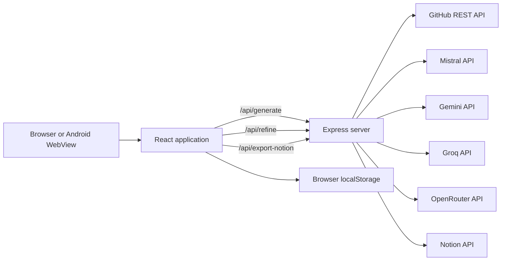
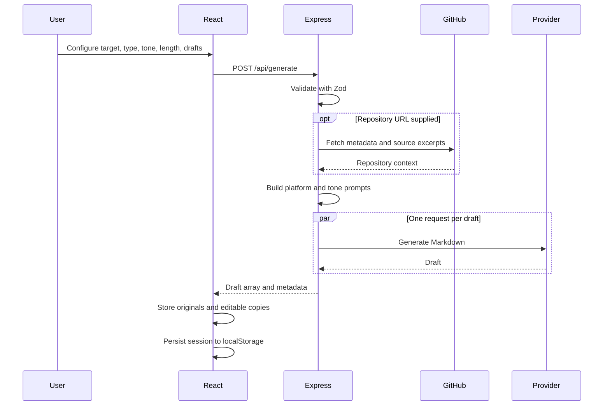

# Architecture

VOID is a two-process-shaped application implemented as one Node.js server:

- Express owns API routes and production static hosting.
- Vite is mounted as Express middleware during development.
- React runs entirely in the browser or Capacitor WebView.
- External services provide repository data, AI generation, and Notion page creation.

There is no database, account system, server-side session store, queue, or background worker.
Browser local storage handles persistence. Elegant? Debatable. Accurate? Finally.

## Runtime Diagram

## Server Lifecycle

`server.ts` is the single backend entry point.

1. Loads `.env` with `dotenv`.
2. Creates an Express application fixed to port `3000`.
3. Applies exact-origin CORS handling.
4. Enables JSON request parsing.
5. Registers three POST endpoints.
6. In development, creates Vite in SPA middleware mode.
7. In production, serves `dist/` and falls back to `dist/index.html`.
8. Listens on `0.0.0.0`.

The production build bundles `server.ts` into CommonJS with esbuild while leaving npm packages
external. The frontend is independently emitted by Vite into the same `dist/` directory.

## Frontend Structure

### Entry point

`src/main.tsx` mounts the React application. `src/index.css` defines Tailwind integration, theme
variables, typography, scrollbars, animation, and Markdown presentation.

### Application shell

`src/App.tsx` owns most product behavior:

- Generation settings.
- Provider keys and selection.
- Target-specific metadata.
- Draft arrays and active version.
- Editor mode and current Markdown.
- Auto-save and restoration.
- Mobile drawer state.
- Refinement and undo state.
- Placeholder replacements.
- Copy and export behavior.

This centralization makes behavior discoverable but also makes `App.tsx` the primary complexity
hotspot. New features should move self-contained behavior into hooks or components once the
abstraction has a real boundary, not merely because someone discovered the `hooks/` folder pattern.

### Supporting components

| Component | Responsibility |
| --- | --- |
| `ComplianceAudit.tsx` | Local heuristic checks and AI fix prompts |
| `DiffViewer.tsx` | Original/current line comparison |
| `DocToneGlossary.tsx` | Searchable descriptions for document and tone options |
| `NotionExportDialog.tsx` | Notion token/page collection and export workflow |
| `components/ui/*` | Shared button, input, select, dialog, card, scroll area, and toast primitives |

### API client

`src/api.ts` creates one Axios instance.

- Browser builds use same-origin requests unless `VITE_API_BASE_URL` is set.
- Native Capacitor builds default to the deployed Cloud Run API URL.
- A configured `VITE_API_BASE_URL` overrides both.

This separation is what prevents the Android package from asking `capacitor://localhost` to run an
Express server inside the phone through sheer optimism.

## Generation Data Flow

For non-repository targets, GitHub failure can degrade to manual application context. For repository
targets, invalid or inaccessible GitHub data fails the request.

## Draft Model

The frontend maintains parallel arrays:

- `versions`: editable current drafts.
- `originalVersions`: immutable generated baselines.

`activeVersionIndex` selects the visible pair. `editedMarkdown` mirrors the active editable draft,
and `originalMarkdown` mirrors its baseline. The diff view compares those two values.

This model supports independent edits across drafts but requires careful synchronization whenever
draft selection or restoration changes.

## Persistence Model

VOID uses browser local storage:

| Key | Contents |
| --- | --- |
| `void_editor_draft` | Markdown, originals, versions, active index, and generation settings |
| `void_custom_keys` | User-entered provider keys as plain JSON |
| `void_selected_provider` | Last provider selection |
| `void_notion_token` | Notion integration token |
| `void_notion_page_id` | Last parent page ID |

There is no encryption despite UI terminology such as "vault." Treat the storage as convenience,
not secret management. See [Security](security.md).

## Android Architecture

The Android application is a Capacitor wrapper:

1. Vite emits web assets to `dist/`.
2. `cap sync android` copies them into the native project and updates plugins.
3. The Gradle project compiles a standard `BridgeActivity`.
4. The WebView loads packaged assets.
5. API calls use the configured remote API base URL.

Only `INTERNET` is declared in the Android manifest. The document generator can describe arbitrary
permissions for a target application, but VOID itself does not request camera, location, storage,
Bluetooth, or notification permissions.

## External Boundaries

| Boundary | Data sent |
| --- | --- |
| GitHub | Owner/repository in URL and optional token in server header |
| AI provider | Repository excerpts, app metadata, prompt instructions, and refinement content |
| Notion | Integration token, page ID, title, and converted document blocks |
| Browser storage | Drafts, preferences, provider keys, and Notion credentials |

These boundaries should drive privacy disclosures, threat modeling, and deployment controls.

## Architectural Constraints

- Port is hard-coded to `3000`.
- Request bodies have no explicit size limit beyond Express defaults.
- Generation requests have no application-level timeout or cancellation.
- Multi-draft generation uses `Promise.all`; one rejected draft rejects the whole batch.
- Refinement is Gemini-only.
- Notion conversion is a lightweight line parser capped at 95 blocks.
- CORS accepts only exact configured origins.
- No server authentication protects API usage.
- No rate limiting protects provider spend.

These are not secret defects. They are the current system boundary and the starting list for serious
production hardening.
